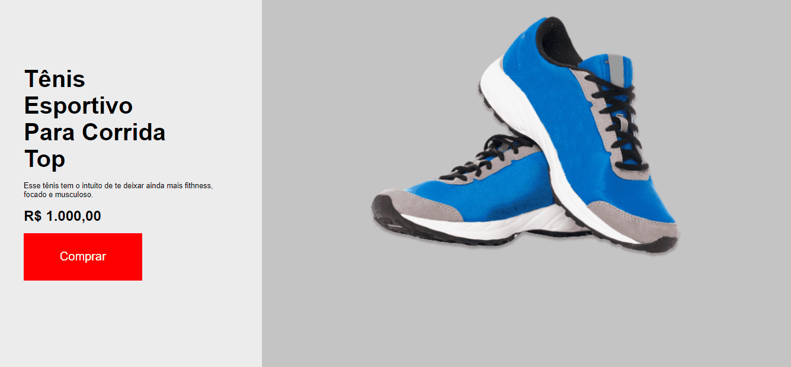

# Projeto landing page

Projeto feito com HTML e CSS, Esse projeto foi sugerido em uma das trilhas gratuitas da plataforma da rocketseat, foi feito para testar os conhecimentos e dominar a ferramenta, projeto statico não existe nenhuma funcionalidade nele. 

#### 🚀 Projeto terminado 🚀

 

## Ilustração do projeto

    

 

## Pré-requisitos

Se você quiser rodar meu projeto em sua maquina você vai precisar ter instalado em sia máquina as seguintes ferramentas [Git](https://desktop.github.com/), além  disto é nesse sario ter um editor para trabalhar com o código como o [VSCode](https://code.visualstudio.com/).

### Rodando o front-end

~~~bash

codigo
 
~~~~